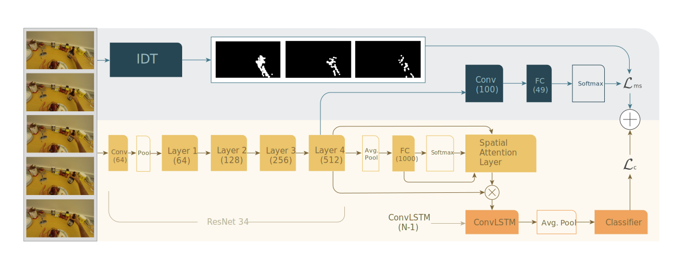

# FPAR-Net
#### A model capable of performing first person action recognition

With this model we explore different methods for performing a first person action recognition task on the GTEA61
dataset. We start by implementing a structure based on Ego-RNN: a two stream architecture that works separately
on the frames of the videos and on motion features extracted from optical flow. We then try to improve on top of this architecture by implementing a self-supervised task capable of working jointly on spatial and temporal features. Finally, we implement a two-in-one stream architecture, embedding RGB and optical flow into a single stream. Details for all the steps are provided in the available [paper](paper.pdf).

## Adding a self-supervised task to Ego-RNN

[Ego-RNN](https://github.com/swathikirans/ego-rnn) is a network used in the 2018 [paper](https://arxiv.org/abs/1807.11794): "Attention is All We Need: Nailing Down Object-centric Attention for Egocentric Activity Recognition", and it is used as the starting point for our architecture. One of the problems of this model is that frames and optical flow features are learned separately, merging the two branches only at the end of the model. Taking this into account, we expand on this architecture by implementing a self-supervised motion segmentation task, and we feed the backbone of the Ego-RNN network to it. As a result of the added MS task, the backbone will try to learn features regarding the object movements, that are supposed to be beneficial to the classification task. The complete schema of the final self-supervised model is pictured in the image below:

## Class activation maps
The original Ego-RNN model makes use of class specific saliency maps, capable of identifying the image regions that are been used by the CNN to identify the class under consideration. However, oftentimes these maps cannot be considered as representative of the activity. As we can see from the animations below, the addition of the MS task proved to be helpful for the identification of the correct regions.

Attentioned with no MS task  |  Attentioned 
:-------------------------:|:-------------------------:
| 

The improvements of this task can be seen also on videos not belonging to the original GTEA61 dataset that was used for training. Here is an example with a home-made video, where we can see how the improved model tends to focus better regions of the image portraying the action.

Attentioned with no MS task  |  Attentioned 
:-------------------------:|:-------------------------:
| 

## Two-in-one stream action detection

After implementing the MS task both as originally conceived in the paper and as a regression problem, we take it a step further, by applying a motion condition and a motion modulation layer to our model, with the goal of using the features from this layers to modulate RGB features.

